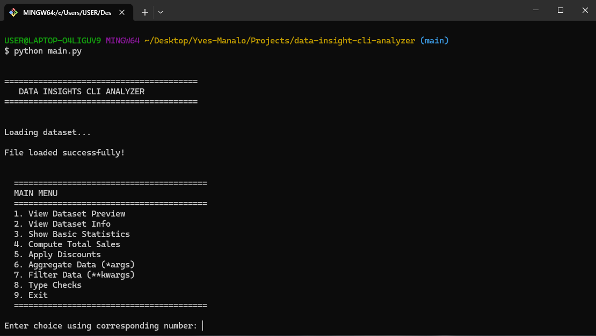
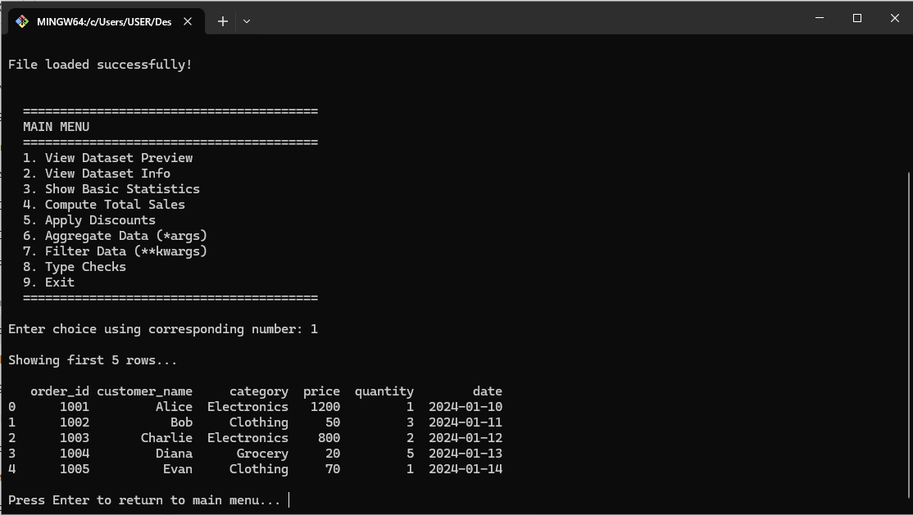
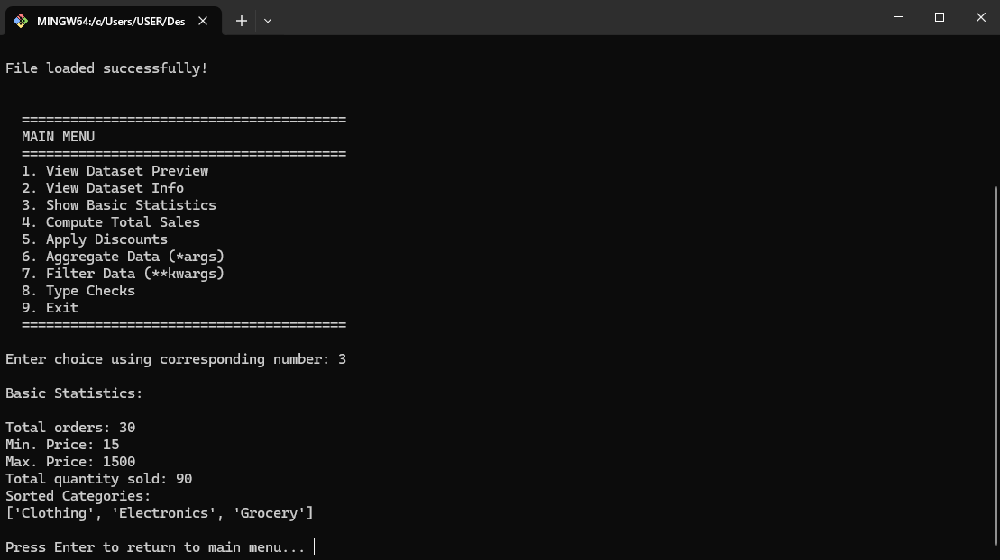
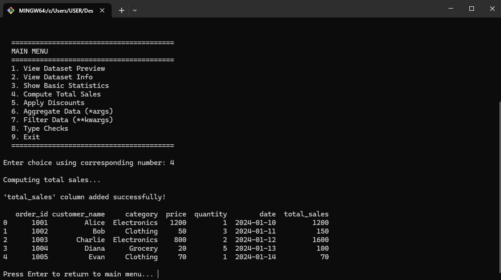
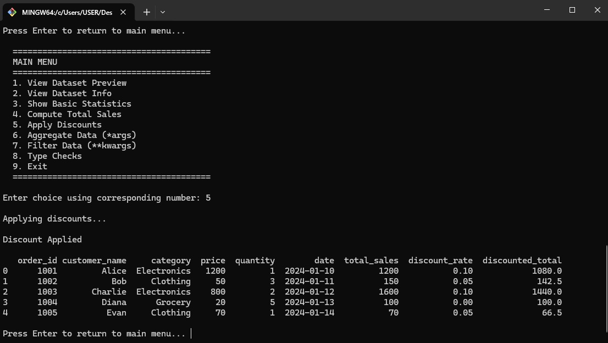
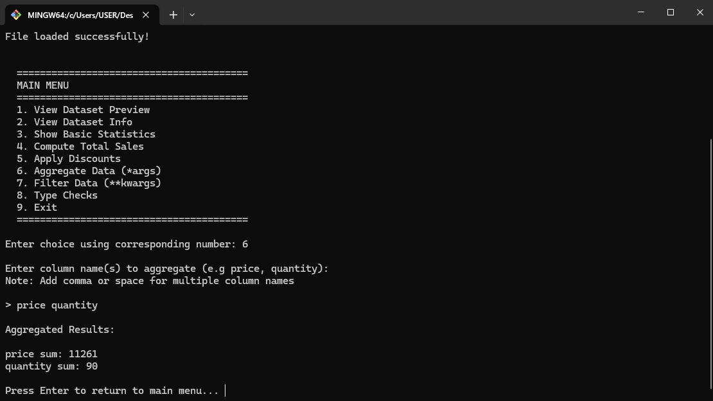
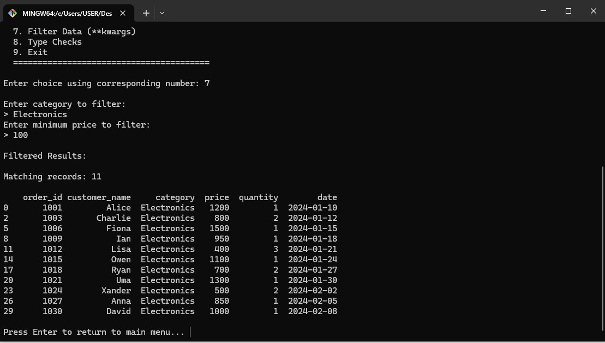
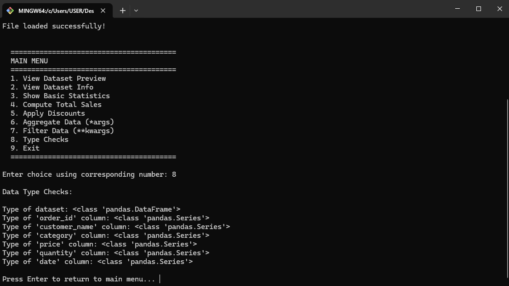
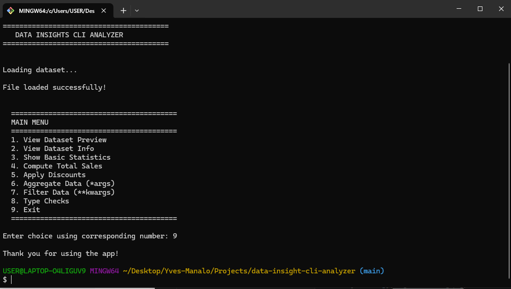

# Data Insights CLI Analyzer



A modular Python command-line application that analyzes CSV datasets using pandas. This project demonstrates real-world data processing, functional programming techniques, and clean software structure.

## Project Overview

The **Data Insights CLI Analyzer** is a terminal-based tool that allows users to load, analyze, and extract insights from structured CSV data.

It is designed to simulate real-world data workflows such as:

- Data loading and validation
- Data exploration
- Data transformation
- Aggregation and filtering
- Error handling

The project follows a modular architecture, separating responsibilities across multiple components for better readability and scalability.

## Project Structure

```
data-insight-cli-analyzer/
│
├── data/
│   └── sales_data.csv
├── images/
│   ├── aggregate-results.png
│   ├── data-insights-cli-analyzer.png
│   ├── data-type-checking.png
│   ├── dataset-preview.png
│   ├── discount.png
│   ├── exit-application.png
│   ├── filteting.png
│   ├── main-menu.png
│   ├── statistics.png
│   └── total-sales.png
├── utils/
│   ├── analyzer.py
│   ├── filter.py
│   └── loader.py
│
├── .gitignore
├── main.py
└── README.md

```

## Features

### Data Loading

- Reads CSV files using pandas
- Handles missing or invalid file paths using error handling (`try/except`)

### Data Exploration

- Displays dataset preview (`head`)
- Shows dataset structure (`info`)

### Data Analysis

- Computes basic statistics using built-in functions:
  - `min()`, `max()`, `sum()`, `sorted()`

### Data Transformation

- Calculates total sales per record
- Applies category-based discounts using **lambda functions + DataFrame[column].apply()**

### Flexible Aggregation

- Aggregates selected columns dynamically using `*args`

### Dynamic Filtering

- Filters dataset based on user input using `**kwargs`

### Error Handling

- Handles:
  - Missing files
  - Invalid column names
  - Invalid data inputs
- Uses `try`, `except`, and `raise`

### Type Checking

- Displays data types using `type()`

## Application Flow

1. Program starts and loads dataset
2. User is presented with a CLI menu
3. User selects an action
4. Corresponding action processes the request
5. Results are displayed in the terminal
6. User returns to menu or exits

## Sample App Navigation

### Main Menu


### Dataset Preview



### Basic Statistics



### Total Sales Computation



### Discount Application



### Aggregate Results



### Filtering Data



### Data Type Checking



### Exit Application



## How to Run

### 1. Clone the Repository

```
git clone https://github.com/your-username/data-insights-cli.git
cd data-insight-cli-analyzer
```

### 2. Install Dependencies

```
pip install pandas
```

### 3. Run the Application

```
python main.py
```

## Dataset

The project uses a sample dataset:

```
data/sales_data.csv
```

**Columns**:

- order_id
- customer_name
- category
- price
- quantity
- date

## Key Learnings

This project helped reinforce the following Python concepts:

- Working with modules and packages
- Data analysis using pandas
- Writing custom functions
- Using \*args and \*\*kwargs for flexible logic
- Functional programming with lambda
- Error handling using try, except, and raise
- Writing modular and maintainable code
- Building CLI-based applications
